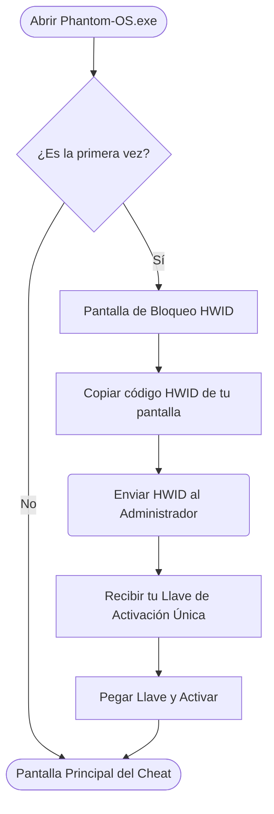
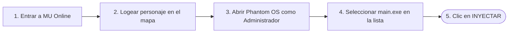
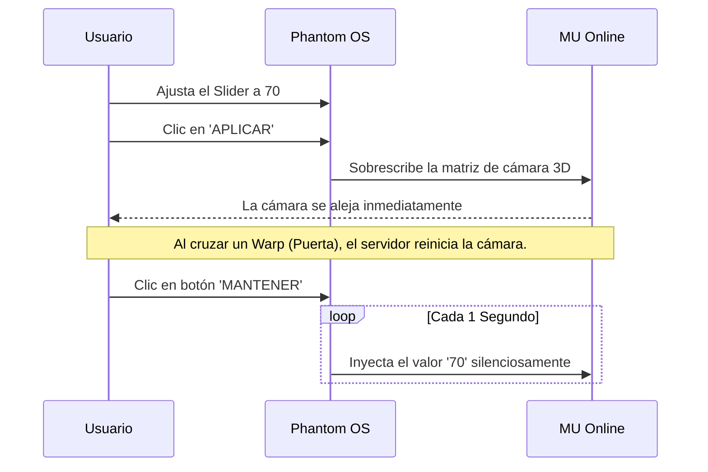
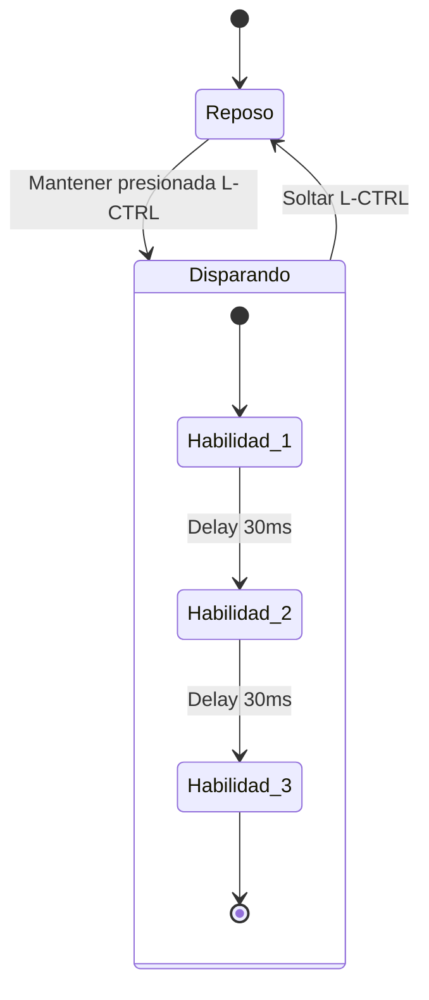
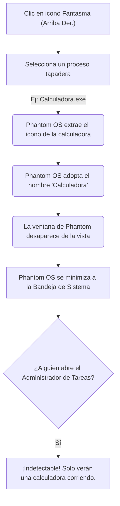

# 📖 Guía de Usuario Completa - Phantom OS

Bienvenido al manual oficial de **Phantom OS**. Esta guía está diseñada para que entiendas visualmente y paso a paso cómo operar cada módulo de la herramienta, garantizando que le saques el máximo provecho de forma segura.

---

## 1. Flujo de Activación (Primer Ingreso)

Phantom OS utiliza un sistema de **Hardware ID (HWID)**. Esto significa que el programa se fusiona con los componentes físicos de tu PC y no puede ser usado por nadie más.

**⚠️ Importante:** Si formateas tu PC o cambias tu Placa Base/Disco Duro, tu HWID cambiará y deberás solicitar una llave nueva.

---

## 2. Flujo de Inyección (Conexión al Juego)

Para que Phantom OS pueda operar, necesita "engancharse" a la memoria de MU Online. **Debe hacerse en un orden estricto para evitar bloqueos del Anti-Cheat.**

* **No inyectes durante la pantalla de carga.** Siempre espera a estar dentro del mapa y ver a tu personaje.
* Si no corres Phantom OS como Administrador (clic derecho > Ejecutar como Administrador), el recuadro de LOGS te arrojará un error de "Acceso Denegado".

---

## 3. Módulo: Zoom Engine 👁️

El Zoom de Phantom OS no modifica archivos del cliente; altera la renderización 3D en la memoria RAM en tiempo real.

---

## 4. Módulo: Auto-Potas y Combos (Mecánica Hardware) ⚔️

Phantom OS no usa funciones simuladas que los Anti-Cheats detectan fácilmente. En su lugar, envía pulsaciones directamente al controlador de tu teclado (SendInput).

### ¿Cómo usar el Combo Inteligente?
El combo no dispara a lo loco. Está diseñado para PvP táctico (como jugar con un Blade Knight).

* **Ventaja Táctica:** Mantienes presionado `Control Izquierdo` y el personaje hace el combo perfecto a velocidad luz. Sueltas `Control` e inmediatamente puedes correr, curarte o lanzar otro hechizo manualmente.

---

## 5. Módulo: Camuflaje / Ghost Mode 👻

¿Haces transmisiones en Twitch, usas Discord Streams, o un GM (Game Master) te pidió revisar tu PC por AnyDesk/TeamViewer? El Ghost Mode te salvará.

### ¿Cómo recuperar la ventana de Phantom OS?
Simplemente ve a la esquina inferior derecha de tu pantalla (junto al reloj de Windows), haz clic en la flechita para ver los "Iconos Ocultos", busca el icono de tu programa tapadera (la Calculadora) y hazle **Doble Clic**. La ventana de Phantom OS volverá a aparecer.

